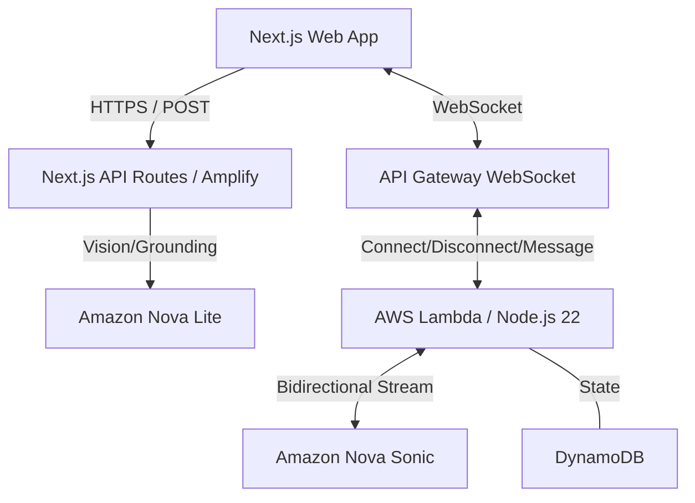

# WorldLens — AI Vision & Voice Assistant

WorldLens is a real-time assistive application designed to help visually impaired individuals navigate and understand their environment. Powered by **Amazon Nova Sonic** and **Amazon Nova Lite**, it provides a low-latency, voice-first interface for grocery shopping, document reading, medication safety, and general environmental awareness.

---

## 🏗️ Architecture

WorldLens uses a hybrid architecture to balance fast, static frontend delivery with robust, persistent bidirectional communication.



### Key Components:
- **Frontend (Next.js):** Hosted on AWS Amplify, providing a responsive UI with real-time VAD (Voice Activity Detection) and motion sensing.
- **WebSocket Pipeline:** Dedicated AWS CDK infrastructure for low-latency, bidirectional audio streaming between the client and Nova Sonic.
- **BFF (Backend-for-Frontend) API:** Server-side routes in Next.js to securely proxy Bedrock vision analysis and grounding requests.
- **Real-Time Pipeline:** Lambda functions bridge the WebSocket API to the Amazon Bedrock streaming interface.

---

## ✨ Features

- **🎙️ Real-Time Voice Assistant:** Natural, bidirectional voice interaction using Nova Sonic.
- **👁️ Multimodal Vision Modes:**
    - **Grocery Mode:** Identifies products, brands, and prices in a shopping aisle.
    - **Document Mode:** High-precision OCR and document analysis for bills, letters, and forms.
    - **Medication Mode:** Critical safety checks for dosage and medicine names.
    - **Environment Mode:** Identifies hazards (traffic lights, obstacles) and scene context.
- **🧠 Stable Session Memory:** Remembers what has been seen across the session to provide context-aware proactive suggestions.
- **⚡ Proactive Insights:** Automatically alerts users to hazards or relevant products based on their current "goal."
- **📊 Real-Time VAD & Motion Detection:** Intelligently captures frames only when significant motion or speech is detected.

---

## 🚀 Getting Started

### Prerequisites
- [AWS Account](https://aws.amazon.com/) with access to Amazon Bedrock (Nova Sonic and Nova Lite models enabled in `us-east-1` or your preferred region).
- [AWS CLI](https://aws.amazon.com/cli/) configured with administrative credentials.
- [Node.js 22+](https://nodejs.org/) installed locally.

### Configuring AWS Credentials

WorldLens implements **Zero-Touch IAM**. You do NOT need to manually create users or access keys in the AWS Console for the application to function.

1. **Configure your "Bootstrap" Identity**: Ensure your local machine has an AWS profile with administrative permissions (needed for the initial deployment).
   ```bash
   aws configure
   ```
2. **Run the Deploy Script**: 
   ```bash
   ./scripts/deploy.sh
   ```
   **What this does automatically:**
   - Bootstraps your AWS environment (if needed).
   - Deploys the main CDK stack.
   - Creates a dedicated **LocalDevUser** with scoped permissions (Bedrock, DynamoDB).
   - Generates an **Access Key/Secret** for this user.
   - Extracts the credentials and the WebSocket URL.
   - Automatically generates a `.env.local` file with all required configuration.

After running the script, your environment is fully configured and ready for local development.

### Installation
1. **Clone the repository:**
   ```bash
   git clone <repo-url>
   cd world-lens
   ```

2. **Install dependencies:**
   ```bash
   npm install
   ```

3. **Deploy Infrastructure:**
   WorldLens uses AWS CDK to provision the voice pipeline and DynamoDB tables.
   ```bash
   chmod +x scripts/deploy.sh
   ./scripts/deploy.sh
   ```
   *This script will bootstrap CDK, deploy the stack, and automatically generate your `.env.local` file with the correct WebSocket URL and region.*

---

## 🛠️ Usage

### Running Locally
```bash
npm run dev
```
Open [http://localhost:3000](http://localhost:3000) on your mobile device (via HTTPS or localhost tunneling) to test the camera features.

### Application Modes
- **Grocery:** Set a goal like "Find healthy cereal." The AI will chime and speak when it sees a match.
- **Document:** Point at a document; the AI will read it out and allow you to ask questions.
- **Medication:** Scan a medicine bottle for safety verification and dosage info.
- **Environment:** Continuous safety monitoring for hazards and scene orientation.

### Voice Sessions
- Tap **"Start Voice Session"** to establish the long-lived connection.
- Use the **Mic button** to toggle active listening.
- Watch the **Transcript overlay** for real-time speech-to-text feedback.

### Debug Panel
Enable the Debug Panel (via the "Show Debug" link at the bottom) to monitor:
- **Memory:** Live state of objects correctly seen.
- **Latency:** Real-time processing speed for vision and voice.
- **Tool Calls:** Inspect the internal reasoning of the AI.
- **WebSocket Status:** Verification of the persistent backend connection.

---

## 🧪 Testing

The project includes a comprehensive test suite (45 suites, 118 tests) covering orchestrators, safety guards, and UI components.
```bash
npm run test
```

---

## 🗑️ Cleanup

To remove all AWS resources provisioned by the project:
```bash
chmod +x scripts/teardown.sh
./scripts/teardown.sh
```

---

## 🛡️ Safety & Privacy
- WorldLens is designed as an assistive tool, not a medical or safety-critical life-support system.
- Images are processed in-memory and NOT stored by the backend.
- Blurry or low-confidence results trigger a "Retry" prompt to avoid hallucinations in sensitive contexts (like medication dosage).

---

## 📄 License

This project is licensed under the MIT License - see the [LICENSE](LICENSE) file for details.
